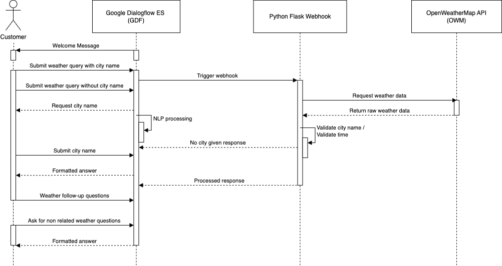

Here’s a ready-to-use README.md template with placeholders:

# AI Weather Chatbot


## Description
The Weather Chatbot is designed to provide instant and interactive weather updates via natural language queries, offering a user-friendly alternative to traditional weather apps. 

The reason why I have devolped such a bot was manly driven by curiosity. I want to understand how conversational AI works because it is a very powerful tool to solve a lot of problems. Furthermore I wanted to figure out, how seamlessy and intuitive I can teak an dedicated chatbotbot with free available software. 

The result can be tested here: https://mariuskalder.io/ai-weather-chatbot/ 

From my point of view this project is a good start to learn and dig deeper into the fundamentals of Natural Langauge Processing (NLP). 
Although Google Dialogflow ES handles the things like Tokenization, Normalization, Stemming and and Named Entity Recognition on its own, you are in charge of letting the model train based on your provided trainingdata (intents) as well as guiding your users with the help of setting the correct context plus the right focus on entities to give a satisfying answer.   

## Architecture



The chatbot follows a modular architecture with three key components:
1. Natural Language Processing (NLP): Handled by Google Dialogflow ES (GDF) for intent recognition and seamless integration.
2. Weather Data Retrieval: Queries OpenWeatherMap (OWM) API for real-time weather updates.
3. Webhook Processing: A Flask-based web application hosted on Pythonanywhere ensures formatted responses and manages invalid requests.

## Scope & Features

- Recognize and respond to queries about temperature, weather conditions, and wind speed.
- Understand both simple and detailed queries (e.g., “What’s the weather in Paris today?” vs. “What will the wind speed be in London tomorrow?”).
- Real data via OpenWeatherMap API
- Only current and max 5 days in advance weatherforecast data
- Operate 24/7 and integrate into a website for easy access across devices.

## Technology Used

- Google Dialogflow ES: Simplifies NLP processing and multi-platform integration (free version).
- OpenWeatherMap API: Chosen for its reliability and extensive free data access (free version).
- Flask Webhook: Handles API calls and responses, hosted on Pythonanywhere (free trial available - up to 3 months hosting).
- Ngrok: To create a secure tunnel from your local machine to the internet (free version)
- My Website: Embedded the chatbot into a Blogpost 
- Git and GitHub 

# Installation
Follow these steps to run the chatbot within the Google Diaogflow ES Website and a locally hosted webhook. 

## Set up Google Dialogflow

Google Dialogflow documentation: 

...

## Set up Webhook 

Webhook and Ngrok

```bash
# Clone the repository
git clone https://github.com/yourusername/project-name.git
cd project-name

# Install dependencies
pip install -r requirements.txt

# Run the application
python main.py
```

## Usage

Explain how to use your project. Include examples and screenshots if necessary.

## Configuration

Provide details on how to configure the project (e.g., environment variables, API keys).


# License

This project is licensed under the MIT License

# Contact & Support

For questions or support, please contact me:
Email: aiweatherchatbot@mariuskalder.io
LinkedIn: 


