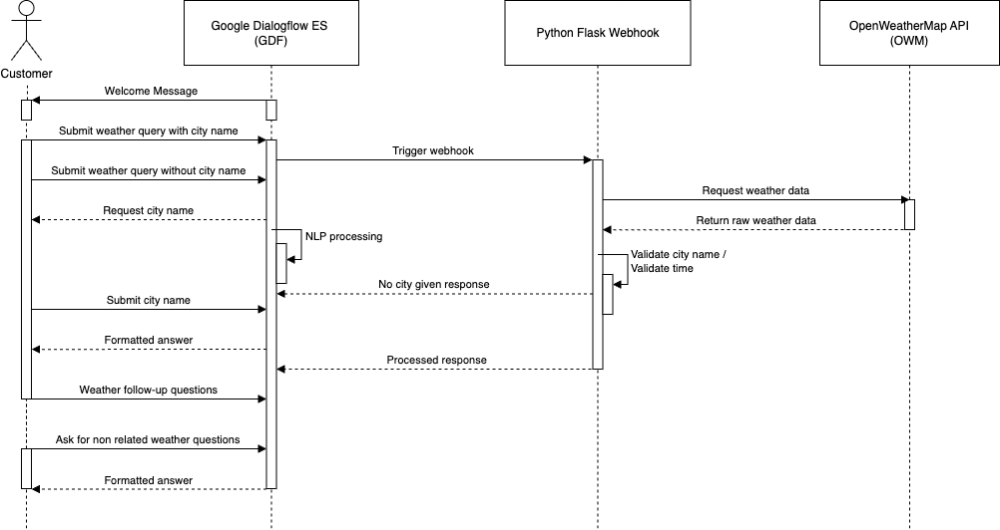

# AI Weather Chatbot


## Description
The Weather Chatbot is designed to provide real-time and interactive weather updates through natural language queries, offering a more intuitive and user-friendly alternative to conventional weather applications.

The primary motivation behind developing this chatbot stemmed from a deep curiosity about conversational AI and its potential to address a wide range of practical challenges. Additionally, this project served as an exploration into the seamless integration of a dedicated chatbot using freely available software. The objective was to assess how effectively such a system could be tailored for natural and intuitive user interactions.

The chatbot is available for testing here: https://mariuskalder.io/ai-weather-chatbot/ 

From a technical perspective, this project provides a solid foundation for further exploration into the core principles of Natural Language Processing (NLP). While Google Dialogflow ES handles essential NLP tasks such as tokenization, normalization, stemming, and named entity recognition autonomously, developers retain significant control over model training. This includes curating training data (intents), defining context to steer user interactions effectively, and optimizing entity recognition to ensure precise and contextually relevant responses. 

## Test Questions

<a href="test/test_questions.pdf" target="_blank">Download PDF</a>

## Architecture



The chatbot follows a modular architecture with three key components:
1. Natural Language Processing (NLP): Handled by Google Dialogflow ES (GDF) for intent recognition and seamless integration.
2. Weather Data Retrieval: Queries OpenWeatherMap (OWM) API for real-time weather updates.
3. Webhook Processing: A Flask-based web application hosted on Pythonanywhere ensures formatted responses and manages invalid requests.

## Scope & Features

- Recognize and respond to queries about temperature, weather conditions, and wind speed.
- Understand both simple and detailed queries (e.g., “What’s the weather in Paris today?” vs. “What will the wind speed be in London tomorrow?”).
- Real data via OpenWeatherMap API
- Only current and max 5 days in advance weatherforecast data
- Operate 24/7 and integrate into a website for easy access across devices.

## Technology Used

- Google Dialogflow ES (GDF): Simplifies NLP processing and multi-platform integration (free version).
- OpenWeatherMap API: Chosen for its reliability and extensive free data access (free version).
- Flask Webhook: Handles API calls and responses, hosted on Pythonanywhere (free trial available - up to 3 months hosting).
- Ngrok: To create a secure tunnel from your local machine to the internet (free version)
- My Website: Embedded the chatbot into a Blogpost 

# Installation
Follow these steps to run the chatbot within the Google Diaogflow ES Website and a locally hosted webhook. 

## Set up Google Dialogflow

Google Dialogflow Documentation: GDF Docs

The folder google_dialogflow_es contains the following subfolders:
1. entities
2. intents

Inside these folders, you will find JSON files that need to be uploaded to Dialogflow. The intents and entities serve as training data to help the bot understand different types of questions and identify relevant entities.

The complete setup guide can be downloaded from my blog post: [Insert Link]

## Set Up Webhook

There are several ways to connect a Flask web application locally with Google Dialogflow (GDF). I personally prefer Ngrok because it’s easy to set up and use. You can find the Ngrok setup guide here: LINK

Steps to Set Up Your Webhook

1. Install Ngrok and start it to expose your local server.

2. Clone the repository:

```bash
git clone https://github.com/MKalder/ai_weather_chatbot.git
```

3. Install dependencies:

```bash
cd ai_weather_chatbot
pip install -r requirements.txt
```

4. Run the application:

```bash
python app.py
```

5. Run ngrok

```bash
ngrok http 5050
```

6. Use the generated ngrok public URL and configure it in Dialogflow as your webhook endpoint

# License

This project is licensed under the MIT License

# Contact & Support

For questions or support, please contact me:
- Email: aiweatherchatbot@mariuskalder.io
- Website: www.MariusKalder.io
- LinkedIn: https://www.linkedin.com/in/marius-kalder/


